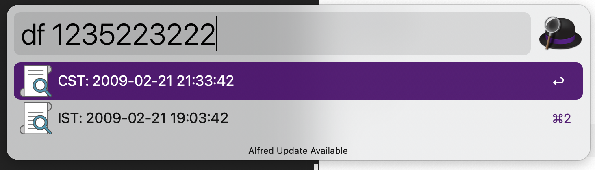
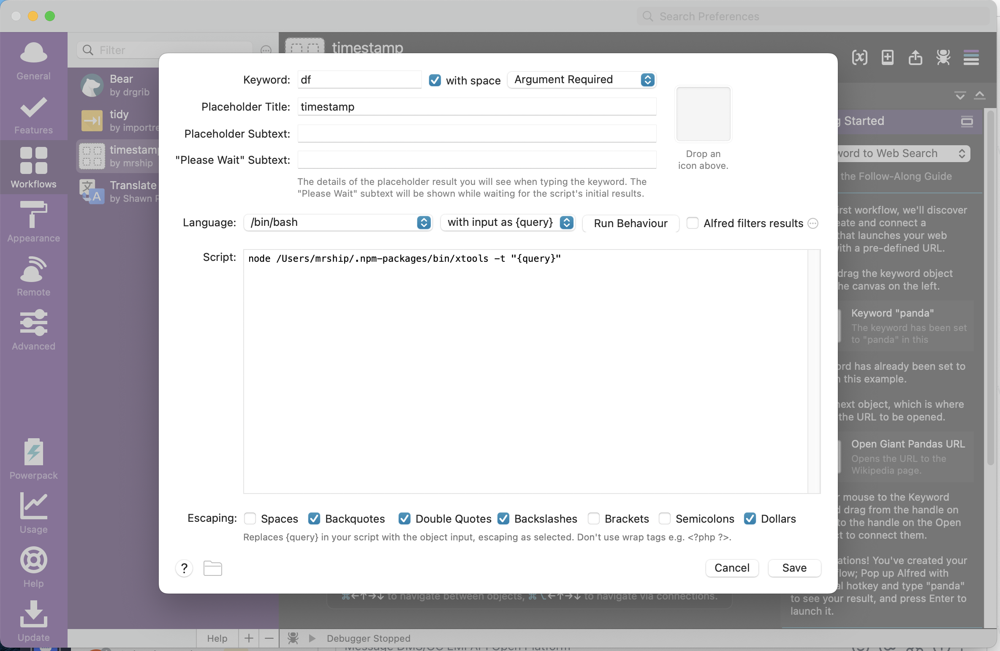

# XTool

## install

```
npm install -g @mrship/xtools
```

## 使用

### 时间戳转日期

input
```
xtools -t timestamp
```

output
```
{"items":[{"title":"CST: 2360-03-01 01:30:22","subtitle":"","arg":""},{"title":"IST: 2360-02-29 23:00:22","subtitle":"","arg":""}]}
```

## 结合Alfred ##




```
node /Your_npm_global_path/.npm-packages/bin/xtools -t "{query}"
```

### 多文件md5

input
```
xtools -m fileA fileB ...
```

output
```
f4f4ac1506b13cae13baea7347528be9 fileA
bb7063c8164ed2d2d794f6c6ea8e6872 fileB
```

### 两个目录下同名文件批量md5比对
input
```
xtools -c dirA dirB
```

output
```
dir A has, but not in dir B:
[
  'animal-sniffer-annotations-x.x.jar',
  'error_prone_annotations-x.x.x.jar',
  'grpc-context-x.x.x.jar'
]
dir B has, but not in dir A:
[

]
md5 result not match:
4b69c051c6ee8704ce85662960bec6b3 dirA/file_a-1.0.0-SNAPSHOT.jar
25333ca90d8be7403a9674b7bca7bf86 dirB/file_a-1.0.0-SNAPSHOT.jar
36c3db29e6966c9af0dce6b56b46b88e dirA/file_b-0.0.1-SNAPSHOT.jar
20589b9755287adf0a287357b80b8bf1 dirB/file_b-0.0.1-SNAPSHOT.jar
f4448d44f8a1ba542ca156c6d0f5a032 dirA/file_c-0.0.1-SNAPSHOT.jar
a52f986dc34075842515c0d184dc5b55 dirB/file_c-0.0.1-SNAPSHOT.jar
```